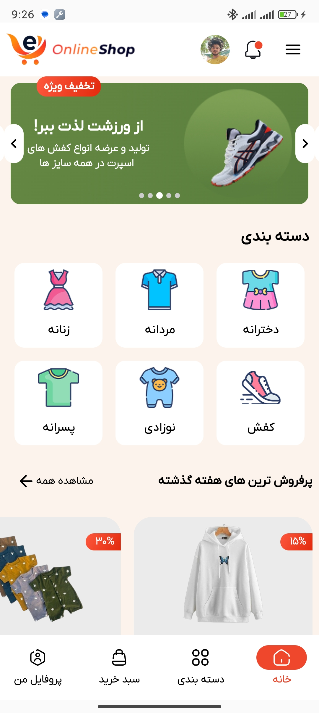
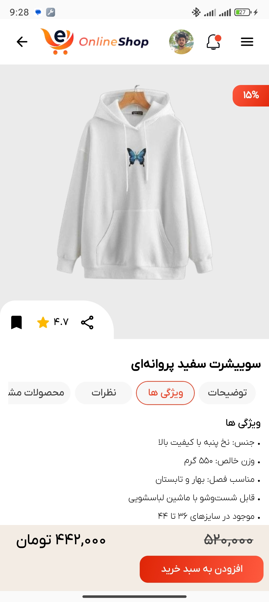

## 📜 Description  
Hi! **Online Shop** is a modern e-commerce application designed for a smooth and intuitive shopping experience.  
Built with **Jetpack Compose** and **Material 3**, the app follows the **MVVM architecture pattern** to ensure high performance, scalability, and maintainability.  
With the power of **Hilt**, **Room Database**, and **Glide**, it provides a seamless product browsing and cart management experience.  
A key feature of the app is the use of **Shared Transition Layout** to deliver beautiful and smooth animations between screens.

**Download Now 🚀**

## Features
- Single Activity architecture  
- MVVM architecture  
- Product listing and cart management  
- Beautiful animations with Shared Transition Layout  
- Dark mode support  

## 🛠 Built With

| Category                  | Technology                     |
|---------------------------|---------------------------------|
| 🏛 Architecture            | MVVM Architecture Pattern       |
| 🖼️ UI Framework            | [Jetpack Compose](https://developer.android.com/jetpack/compose) |
| 🛠️ Dependency Injection    | [Dagger-Hilt](https://dagger.dev/hilt/) |
| 🗄️ Local Database          | [Room Database](https://developer.android.com/jetpack/androidx/releases/room) |
| 🖼️ Image Loading           | [Glide](https://github.com/bumptech/glide) |
| 🌐 Navigation              | [Compose Navigation](https://developer.android.com/jetpack/compose/navigation) |
| 🎞️ Shared Element Animation| [Shared Transition Layout](https://developer.android.com/develop/ui/compose/animation/shared-elements) |

## 🎥 Demo Video

## 📱 Screenshots
<table style="width:100%">
  <tr>
    <th>Home Screen</th>
    <th>Category Screen</th> 
    <th>Cart Screen</th> 
  </tr>
  <tr>
    <td></td> 
    <td></td>
    <td></td>
  </tr>
  <tr>
    <th>Profile Screen</th>
    <th>Favorit Screen</th> 
    <th>ProductDetail Screen</th> 
  </tr>
  <tr>
    <td></td> 
    <td></td>
    <td></td>
  </tr>
</table>
